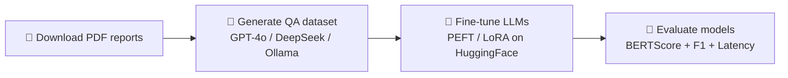

<p align="center">
  <h1 align="center">🇨🇴 Colombian Conflict Chatbot</h1>
  <p align="center"><em>Sistema de Pregunta-Respuesta (QA) sobre el conflicto armado colombiano</em></p>
</p>

<p align="center">
  <a href="https://huggingface.co/datasets/jdavit/colombian-conflict-SQA"></a>
  <a href="https://huggingface.co/collections/raulgdp/chatbot-jep"></a>
  
  
</p>

---

## 📖 About

This project builds an **end-to-end Question Answering (QA) system** grounded in official reports about the **Colombian armed conflict**. It covers the full pipeline from automated dataset generation to fine-tuned LLMs and a Retrieval-Augmented Generation (RAG) chatbot deployed with a Gradio web UI.

The system uses official reports (*informes*) from Colombian truth and memory institutions—such as the **Jurisdicción Especial para la Paz (JEP)** and the **Comisión de la Verdad**—as its knowledge base.

---

## 🏗️ Project Pipeline



---

## 📂 Project Structure

```
📁 notebooks/
├── 📁 utils/                          # Dataset generation & utilities
│   ├── download-reports.ipynb         # Selenium-based PDF report downloader
│   ├── AI-instance-generator.ipynb    # QA dataset generation via OpenAI GPT-4o
│   ├── local-AI-dataset-generator.ipynb  # QA generation via local Ollama models
│   ├── requirements.txt               # Dependencies
│   ├── 📁 prompts/                    # Prompt templates for QA generation
│   │   ├── basic_question1.txt        # "Main findings" prompt
│   │   ├── basic_question2.txt        # "Specific events/testimonies" prompt
│   │   └── basic_question3.txt        # "Structural causes & recommendations" prompt
│   └── 📁 dataset/                    # Generated QA datasets
│       ├── instances_generated_v1.json
│       ├── instances_generated_v1_2.json
│       └── test_instances_generated_v1_2.json
│
├── 📁 model_test/                     # Model evaluation notebooks
│   ├── testing_models.ipynb           # Mistral-7B-Instruct-v0.3 evaluation
│   ├── Mistral-7B-Instruct-v0.3.ipynb
│   ├── Mistral-8B-Instruct-2410-009.ipynb
│   ├── Llama-3.2-3B-Instruct-JEP.ipynb
│   ├── Llama-2-7B-Nous-Hermes-llama-JEP.ipynb
│   ├── OpenHermes-2.5-Mistral-7B-JEP.ipynb
│   └── colombian-conflict-chat-Llama3.1_(8B).ipynb  # GGUF quantized CPU inference
│
├── 📁 RAGs/mistral/                   # RAG chatbot implementations
│   ├── Mistral_7b_chat.ipynb          # Full RAG chatbot with Gradio UI + FAISS
│   ├── mistral-finetuned-CC-QA-System.ipynb   # Two-level retrieval QA system
│   ├── mistral-finetuned-CCchatbot.ipynb      # RAG with saved FAISS index
│   ├── openAI-RAG-CCchatbot.ipynb     # OpenAI-powered RAG (GPT-4.1 + Ada)
│   ├── rag stats.ipynb                # Human evaluation statistics
│   ├── sync reports.ipynb             # Google Drive sync utility
│   └── 📁 faiss_index/                # Saved FAISS vector indices
│
└── 📁 Trials/                         # Experimental & early prototypes
    ├── Q_A_logchain.ipynb             # LangChain-based QA prototype
    ├── Copy of SQUAD_es_v8_GPU.ipynb  # BETO (Spanish BERT) extractive QA
    ├── 📁 ask-pdf/                    # LangChain + Pinecone PDF QA
    └── 📁 QA-roberta_2/               # RoBERTa SQuAD-style fine-tuning
```

---

## 🤖 Models

### Fine-tuned LLMs (PEFT / LoRA)

| Base Model | Fine-tuned Adapter | Architecture |
|------------|-------------------|--------------|
| `mistralai/Mistral-7B-Instruct-v0.3` | `raulgdp/Mistral-7B-Instruct-v0.3-JEP` | Mistral 7B |
| `mistralai/Ministral-8B-Instruct-2410` | `raulgdp/Mistral-8B-Instruct-2410-009` | Mistral 8B |
| `meta-llama/Llama-3.2-3B-Instruct` | `raulgdp/Llama-3.2-3B-Instruct-JEP` | Llama 3.2 |
| `NousResearch/Nous-Hermes-llama-2-7b` | `raulgdp/Llama-2-7B-Nous-Hermes-llama-JEP` | Llama 2 |
| `teknium/OpenHermes-2.5-Mistral-7B` | `raulgdp/OpenHermes-2.5-Mistral-7B-JEP` | Mistral 7B |
| `jdavit/colombian-conflict-chat-Llama3.1` (GGUF) | — | Llama 3.1 (8B, Q5_K_M) |

All adapters use the **`-JEP`** suffix, referring to Colombia's **Jurisdicción Especial para la Paz** (Special Jurisdiction for Peace).

### Embedding Models (for RAG retrieval)

- `BAAI/bge-large-es` — Spanish-optimized embeddings
- `sentence-transformers/paraphrase-multilingual-MiniLM-L12-v2` — Multilingual
- `sentence-transformers/all-mpnet-base-v2` — English (early experiments)
- `text-embedding-ada-002` — OpenAI embeddings (RAG variant)

### External APIs Used

- **OpenAI**: GPT-4o, GPT-4.1 (dataset generation + RAG selection)


---

## 📊 Dataset

The dataset **[`jdavit/colombian-conflict-SQA`](https://huggingface.co/datasets/jdavit/colombian-conflict-SQA)** (SQA = *Spanish Question Answering*) contains QA triples generated from **500+ official PDF reports** about the Colombian armed conflict.

### Topics Covered
- Forced displacement & massacres
- Paramilitary & guerrilla groups
- Human rights violations
- Structural causes of the conflict
- Memory, truth & reconciliation
- Community resistance
- Forced disappearance
- Gender-based violence
- State responsibility

### Question Types
1. **Main findings** — general conclusions of each report
2. **Specific events / testimonies** — detailed cases, names, dates
3. **Structural causes & non-repetition recommendations** — deeper analysis

### Test Set
Includes **out-of-domain negative examples** (e.g., *"What is the capital of Japan?"*) to validate that models correctly **refuse to answer** off-topic questions.

---

## 🔍 RAG System

The Retrieval-Augmented Generation (RAG) chatbot operates in two stages:

1. **Report Selection**: FAISS index over report titles/descriptions → top-k most relevant reports
2. **Context Retrieval + Generation**: Per-report FAISS index over PDF chunks → retrieve context → fine-tuned LLM generates answer


---

## 📈 Evaluation

Models are evaluated on the test split of `colombian-conflict-SQA` using:

| Metric | Description |
|--------|-------------|
| **BERTScore** | Semantic similarity with Spanish BERT embeddings |
| **Token-level F1** | Precision & recall over word tokens |
| **Latency** | Inference time per question (seconds) |

Human evaluation (in `rag stats.ipynb`) uses 6 criteria: **accuracy, relevance, coverage, clarity, justification, and overall score**.

---

## 🚀 Quick Start

### Requirements
- Python 3.10+
- CUDA-compatible GPU (recommended) or CPU with GGUF quantized models

### Install dependencies
```bash
# Core dependencies
pip install datasets transformers peft accelerate bitsandbytes

# For RAG
pip install faiss-cpu sentence-transformers gradio pypdf

# For GGUF models (CPU inference)
pip install llama-cpp-python

# For dataset generation
pip install openai ollama docarray chromadb
```

### Load a fine-tuned model
```python
from peft import PeftModel
from transformers import AutoModelForCausalLM, AutoTokenizer

base_model = "mistralai/Mistral-7B-Instruct-v0.3"
adapter = "raulgdp/Mistral-7B-Instruct-v0.3-JEP"

model = AutoModelForCausalLM.from_pretrained(base_model, device_map="auto")
model = PeftModel.from_pretrained(model, adapter)
tokenizer = AutoTokenizer.from_pretrained(base_model)
```

### Load the dataset
```python
from datasets import load_dataset

dataset = load_dataset("jdavit/colombian-conflict-SQA")
print(dataset["test"][0])
```

---

## 📚 Resources

- **`resources/listado-informes.xlsx`** — Master listing of all 500+ reports (ID, title, description, URL)
- **`reports-pdf/`** — Downloaded PDF reports (naming: `{code}-CI-{number}.pdf`)
- **`docs/`** — Thesis document (`Tesis - Sistema Pregunta Respuesta Sobre el conflicto armado.pdf`) and architecture diagrams

---

## 🔗 Links

| Resource | URL |
|----------|-----|
| 📦 Dataset | [jdavit/colombian-conflict-SQA](https://huggingface.co/datasets/jdavit/colombian-conflict-SQA) |
| 🤗 Fine-tuned Models | [raulgdp/chatbot-jep](https://huggingface.co/collections/raulgdp/chatbot-jep) |

---

## 📝 License

This project is licensed under the MIT License — see the [LICENSE](LICENSE) file for details.

---

<p align="center">
  <sub>Built with ❤️ for truth, memory, and peace in Colombia 🇨🇴</sub>
</p>
